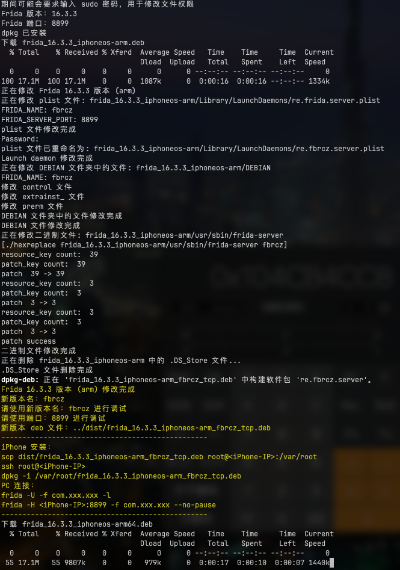
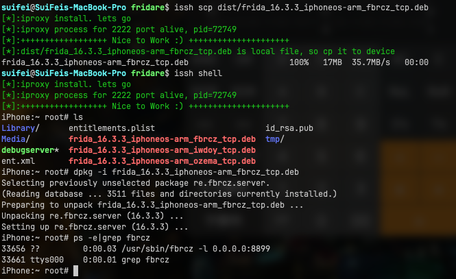

# Fridare


[](https://github.com/suifei?tab=followers)
[](https://twitter.com/csuifei)

Fridare 是一个用于修改和定制 Frida（魔改） 服务器的工具，专为 iOS 越狱设备设计。它允许用户更改 frida-server 的名称和端口，以增强安全性和灵活性。免除了很多越狱检测frida的情况。
[CHANGELOG](CHANGELOG.md)

## 特性

- 自动下载并修改指定版本的 frida-server 
- 随机生成新的 frida-server 名称
- 自定义 frida-server 端口
- 支持 arm 和 arm64 架构
- 二进制替换修改 frida-server
- 生成可直接安装的修改版 .deb 包

### 新增特性

- 引入 `autoinstall.sh` 脚本，实现 Frida 插件的自动部署。
- 引入 `Makefile`，简化项目的构建和部署流程。
- 运行之前请确保本机已经安装了 [issh](https://github.com/4ch12dy/issh) 命令。并配置好了 ssh 的免密登录。
   > 配置 issh 的 ssh 免密登陆
   ```shell
   # 生成 keygen 密钥，如果已生成可以跳过
   ssh-keygen -t rsa -b 4096 -C "<EMAIL>"
   # 配置手机IP，如果USB连接可以不配置
   issh ip set <iPhone-IP>     
   # 拷贝公钥到手机 /var/root ，需要 root 密码 alpine
   issh scp ~/.ssh/id_rsa.pub  
   # 远程服务器添加公钥到 authorized_keys 文件
   issh run "mkdir -p ~/.ssh && cat /var/root/id_rsa.pub >> ~/.ssh/authorized_keys && chmod 600 ~/.ssh/authorized_keys && chmod 700 ~/.ssh"
   ```

## 前提条件

- macOS 操作系统（用于运行构建脚本）
- Homebrew
- dpkg（将通过 Homebrew 自动安装，如果尚未安装）
- 越狱的 iOS 设备
- 在 iOS 设备上安装 OpenSSH

## 使用方法

1. 克隆此仓库：
```shell
git clone https://github.com/suifei/fridare.git
cd fridare
```

2. 使用 Makefile 构建和部署：
```shell
make build       # 构建项目
make deploy      # 部署项目
```

2. 运行构建脚本：
```shell
./build.sh [FRIDA_VERSION] [FRIDA_SERVER_PORT] [CURL_PROXY]
```

例如：
```shell
./build.sh 16.3.3 8899 http://127.0.0.1:1081
```
如果不指定参数，脚本将使用默认值（Frida 版本 16.3.3，端口 8899）。
CURL_PROXY 为可以访问github的代理地址，如果不需要代理，可以不传递。

3. 脚本将下载指定版本的 Frida，修改它，并在 `dist` 目录中生成新的 .deb 包。

```shell
$ ./build.sh 16.3.1 8888 http://127.0.0.1:1081
```



4. 将生成的 .deb 包传输到您的 iOS 设备：
```shell
scp ./dist/frida_16.3.3_iphoneos-arm_tcp.deb root@<iPhone-IP>:/var/root/
```

5. SSH 进入您的 iOS 设备并安装修改后的包：
```shell
ssh root@<iPhone-IP>
dpkg -i /var/root/frida_16.3.3_iphoneos-arm_tcp.deb
```

## 安装兼容版本的 Frida 工具

为确保兼容性，请安装与修改后的服务器版本相匹配的 Frida 工具：
```shell
pip install frida-tools==12.4.3
```
对于 Node.js 用户：
```shell
npm install frida@16.3.3
```

## 使用

如果不使用usb数据线时，可以使用以下命令连接到远程 frida-server ：
```shell
frida -H <iPhone-IP>:8899 -U
frida-trace -H <iPhone-IP>:8899 ...
frida-ps -H <iPhone-IP>:8899
frida-inject -H <iPhone-IP>:8899 ...
```

## 原理
Fridare 项目的核心原理：

### 1. frida-server 修改原理

Fridare 的核心思想是修改 frida-server ，使其更难被检测。这主要通过以下几个方面实现：

- 重命名服务器文件：
   将 `frida-server` 重命名为随机生成的名称（如 `abcde`），这样可以避免简单的名称检测。

- 修改启动配置：
   更新 LaunchDaemons plist 文件，使其使用新的服务器名称和自定义端口。这样可以改变服务器的启动方式和监听端口。

- 二进制文件修改：
   使用二进制替换技术，将服务器二进制文件中的 "frida" 相关字符串替换为自定义字符串。这可以避免通过扫描二进制文件来检测 Frida。

### 2. deb 包修改和重打包

项目使用 dpkg-deb 工具解包和重新打包 deb 文件。这允许我们修改包的内容，包括：

- 更新 DEBIAN/control 文件中的包名
- 修改 DEBIAN/extrainst_ 和 DEBIAN/prerm 脚本以使用新的服务器名称
- 替换和重命名实际的服务器二进制文件

### 3. 自动化流程

build.sh 脚本自动化了整个过程：

- 下载指定版本的 frida-server 
- 生成随机名称
- 修改所有必要的文件
- 重新打包 deb 文件

### 4. 兼容性考虑

脚本同时处理 arm 和 arm64 架构的包，确保在不同的 iOS 设备上的兼容性。

### 5. 安全性增强

通过更改服务器名称、端口和内部字符串，这个项目使得通过常规方法检测 Frida 的存在变得更加困难。这对于在某些可能会主动检测和阻止 Frida 的应用中使用 Frida 非常有用。

### 6. 灵活性

通过允许用户指定 Frida 版本和端口，该工具提供了很大的灵活性，可以适应不同的需求和环境。

### 7. 二进制修改技术

使用 [hexreplace](hexreplace/main.go) 来执行二进制替换，在不重新编译 Frida 的情况下修改二进制文件。这种方法虽然有效，但也有局限性，因为它只能替换固定长度的字符串。

## 注意事项

- 默认的 root 用户密码为 "alpine"。出于安全考虑，强烈建议更改此密码。
- 请确保您的 iOS 设备已越狱并安装了 OpenSSH。
- 此工具仅用于教育和研究目的。请遵守所有适用的法律和条款。

## 贡献

欢迎提交问题和拉取请求。对于重大更改，请先开issue讨论您想要更改的内容。

## 许可证

[MIT LICENSE](LICENSE)
