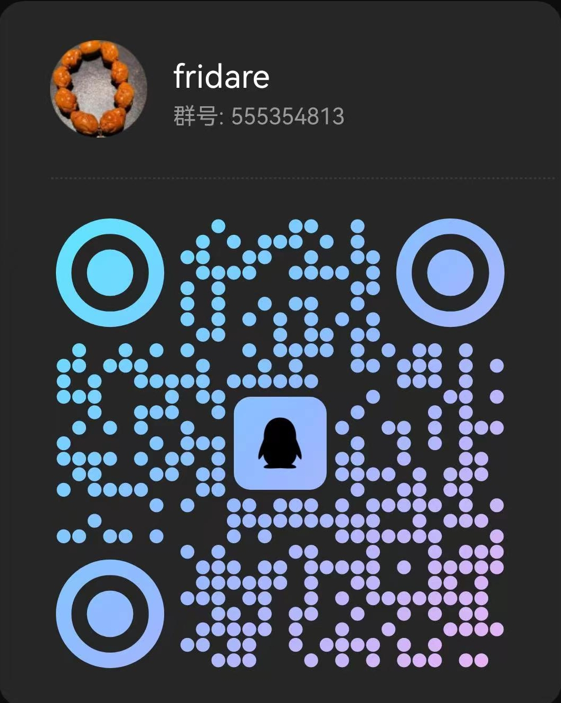
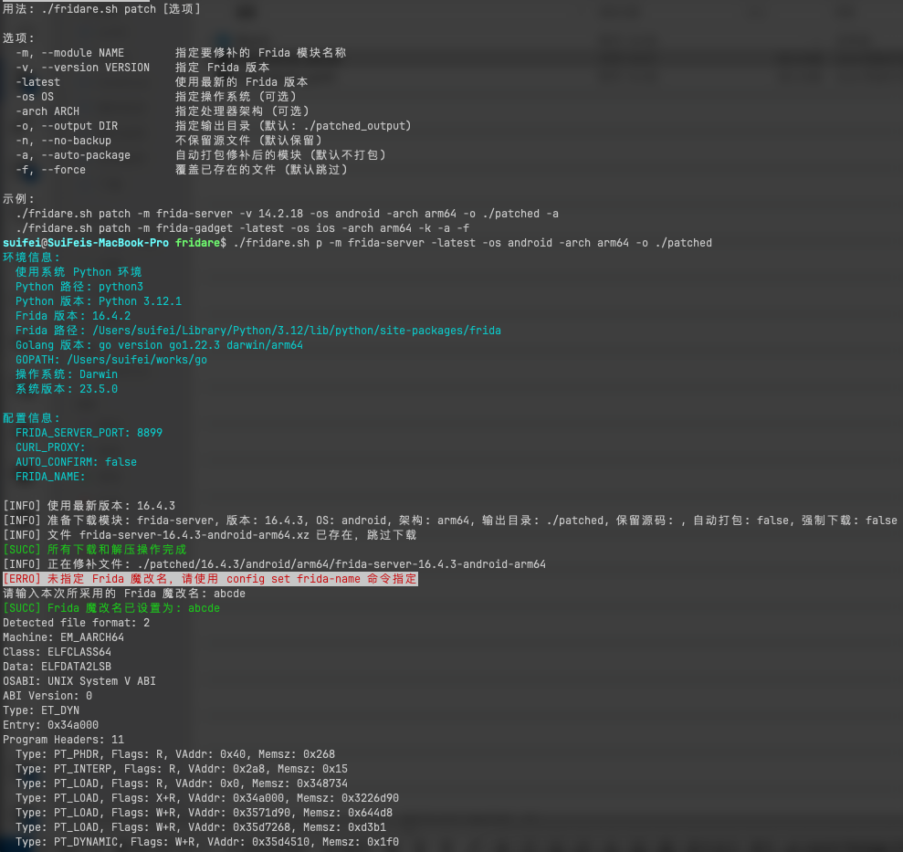

# Fridare

[English](#Features) | [中文](#特性)

[](https://git.io/streak-stats)
 


[](https://github.com/suifei?tab=followers)
[](https://twitter.com/csuifei)

Fridare 是一个用于 iOS frida 插件、Android,linux,Windows 等平台 frida-server 的自动化魔改工具。它允许用户更改名称和端口，以增强安全性和灵活性。免除了很多越狱检测frida的情况。
[CHANGELOG](CHANGELOG)

欢迎大家入QQ群讨论：[QQ 555354813](screenshots/555354813.jpg) ，如本项目对你有所帮助，记得给作者加星鼓励哦！

## 特性

- 自动下载并修改指定版本的 frida-server 
- 随机生成新的 frida-server 名称
- 自定义 frida-server 端口
- 支持 arm 和 arm64 架构
- 二进制替换修改
   - frida-server
   - frida-agent.dylib
   - frida-tools
- 生成可直接安装的修改版 .deb 包
- 一体化命令行界面，提供多种功能
- 配置文件支持，可保存用户设置
- 自动检查和安装依赖
- 下载特定 Frida 模块
- 列出可用 Frida 版本和模块
- 支持 Conda 环境
- 支持 macho, elf, pe 文件格式
- 支持 Windows,Linux,MacOS,Android,IOS
- 支持自更新

一键安装:
```shell
 curl -s https://raw.githubusercontent.com/suifei/fridare/main/fridare.sh | bash -s install
```

### v3.1.1
- 增加了 `upgrade` 命令，用于自动更新 Fridare 脚本

### v3.1.0
- 增加了 `patch` 命令，用于修补指定的 Frida 模块
   - 例如：`安卓 frida-server` `./fridare.sh p -m frida-server -latest -os android -arch arm64 -o ./patched`
- 增加了对 `patch` 命令的帮助信息
- 增加对 ELF 和 PE 文件格式的支持(支持 Windows,Linux,MacOS,Android,IOS)
- 更新了 `build`、`download` 等命令的用法说明
- 修复了一些小的 Bug 并改进了脚本的稳定性



### v3.0.1 Fixed
- 修复在 Conda 环境中无法正确识别和修改 Frida 工具的问题
- 解决多个 Python 环境共存时的兼容性问题

### 新增特性 v3.0.0
- 新增 `fridare.sh` 脚本，整合所有功能，提供更完整的命令行界面
- 新增 `build`, `ls`, `download`, `lm`, `setup`, `config`, 和 `help` 命令
- 新增配置文件支持，可以保存和加载用户设置
- 新增颜色输出，提升用户体验
- 新增自动检查和安装依赖功能
- 新增下载特定 Frida 模块的功能
- 新增列出可用 Frida 版本和模块的功能

### v2.2.0 (仅测试 macOS arm 架构，其它架构未测试)
- 新增加 frida-tools 补丁，适配 `frida:rpc` 特征魔改
   - 解决 Android 内存扫描该字符串问题
   - 自动扫描本地 pip 安装 frida-tools 的位置，对 `core.py` 文件进行魔改，对 `_frida.abi3.so` 文件进行魔改
- 新增加 frida-agent.dylib 魔改，从文件名称，加载位置进行隐藏
   - 解决 agent 加载未隐藏问题

### v2.1.1

- 引入 `autoinstall.sh` 脚本，实现 Frida 插件的自动部署。
- 引入 `Makefile`，简化项目的构建和部署流程。
- 运行之前请确保本机已经安装了 [issh](https://github.com/4ch12dy/issh) 命令。并配置好了 ssh 的免密登录。
   > 配置 issh 的 ssh 免密登陆
   ```shell
   # 生成 keygen 密钥，如果已生成可以跳过
   ssh-keygen -t rsa -b 4096 -C "<EMAIL>"
   # 配置手机IP，如果USB连接可以不配置
   issh ip set <iPhone-IP>     
   # 拷贝公钥到手机 /var/root ，需要 root 密码 alpine
   issh scp ~/.ssh/id_rsa.pub  
   # 远程服务器添加公钥到 authorized_keys 文件
   issh run "mkdir -p ~/.ssh && cat /var/root/id_rsa.pub >> ~/.ssh/authorized_keys && chmod 600 ~/.ssh/authorized_keys && chmod 700 ~/.ssh"
   ```

## Frida 魔改脚本的结构和功能
```shell
fridare.sh - Frida 魔改脚本
│
├── 主要功能
│   ├── 构建魔改版 Frida (build)
│   │   ├── 支持指定版本或最新版本
│   │   ├── 自动生成随机5字符名称
│   │   ├── 自定义端口设置
│   │   └── 支持 arm 和 arm64 架构
│   ├── 列出可用 Frida 版本 (ls, list)
│   │   └── 从 GitHub API 获取版本信息
│   ├── 下载特定版本 Frida (download)
│   │   ├── 支持下载单个或所有模块
│   │   └── 可选的自动解压功能
│   ├── 列出可用 Frida 模块 (lm, list-modules)
│   ├── 检查并安装系统依赖 (setup)
│   │   ├── 自动检测缺失依赖
│   │   └── 使用包管理器安装依赖
│   └── 配置选项设置 (config)
│       ├── 设置 HTTP 代理
│       ├── 设置 Frida 服务器端口
│       └── 设置 Frida 魔改名称
│
├── 脚本结构
│   ├── 初始化配置 (initialize_config)
│   │   └── 读取和创建配置文件
│   ├── 参数解析 (parse_arguments)
│   │   └── 支持多种命令行选项
│   ├── 命令处理
│   │   ├── build: 构建魔改版 Frida
│   │   ├── patch: 修补指定的 Frida 模块
│   │   ├── setup: 设置环境
│   │   ├── config: 管理配置
│   │   ├── list: 列出版本
│   │   ├── download: 下载模块
│   │   └── list-modules: 列出模块
│   └── 主函数 (main)
│       └── 整合所有功能的入口点
│
├── 构建过程 (build_frida)
│   ├── 版本检查
│   │   └── 支持最新版本自动检测
│   ├── 环境准备
│   │   ├── 检查 Python 环境 (包括 Conda)
│   │   └── 检查 Golang 环境
│   ├── 下载 Frida (download_frida)
│   ├── 解包 deb 文件
│   ├── 修改文件
│   │   ├── 修改启动守护程序 (modify_launch_daemon)
│   │   │   └── 更新 plist 文件
│   │   ├── 修改 Debian 文件 (modify_debian_files)
│   │   │   ├── 更新 control 文件
│   │   │   ├── 更新 extrainst_ 文件
│   │   │   └── 更新 prerm 文件
│   │   └── 修改二进制文件 (modify_binary)
│   │       ├── 修改 frida-server
│   │       ├── 修改 frida-agent.dylib
│   │       └── 使用 hexreplace 工具
│   ├── 重新打包 deb 文件 (repackage_deb)
│   └── 修改 frida-tools (modify_frida_tools)
│       ├── 修改 Python 库文件
│       └── 更新 core.py 中的字符串
│
├── 辅助功能
│   ├── 日志输出 (log_info, log_success, log_warning, log_error)
│   │   └── 支持彩色输出
│   ├── 用户确认 (confirm_execution)
│   │   └── 可选的自动确认模式
│   ├── 依赖检查 (check_dependencies)
│   ├── 依赖安装 (install_dependencies)
│   ├── 配置管理 (set_config, unset_config, list_config)
│   └── Frida 版本和模块列表 (list_frida_versions, list_frida_modules)
│
├── 下载功能 (download_frida_module)
│   ├── 版本选择 (最新版或指定版本)
│   ├── 模块选择 (单个模块或全部模块)
│   ├── 下载过程
│   │   └── 支持 HTTP 代理
│   └── 解压处理
│       └── 可选的自动解压功能
│
└── 安全和权限
    ├── sudo 权限保持 (sudo_keep_alive)
    └── 清理过程 (cleanup)
```

## 前提条件

- macOS 操作系统（用于运行构建脚本）
- Homebrew
- Python 3
- Go (用于编译 hexreplace 工具)
- 越狱的 iOS 设备
- 在 iOS 设备上安装 OpenSSH

## 安装

1. 克隆此仓库：
```shell
git clone https://github.com/suifei/fridare.git
cd fridare
```

2. 运行设置命令
```shell
./fridare.sh setup
```
此命令将检查并安装所需的依赖项。

3. 查看帮助
```shell
./fridare.sh help
```

## 使用方法
Fridare 提供了多个命令来满足不同的需求：

### 命令清单

1. `build`: 重新打包 Frida
2. `ls` 或 `list`: 列出可用的 Frida 版本
3. `download`: 下载特定版本的 Frida
4. `lm` 或 `list-modules`: 列出可用的 Frida 模块
5. `setup`: 检查并安装系统依赖
6. `config`: 设置配置选项
7. `help`: 显示帮助信息

### 使用范例

1. 构建魔改版 Frida
```shell
./fridare.sh build -v 16.0.19 -p 8899 -y
```
这个命令会构建版本 16.0.19 的 Frida，设置端口为 8899，并自动确认所有提示。

2. 列出可用的 Frida 版本
```shell
./fridare.sh ls
```

3. 下载特定版本的 Frida
```shell
./fridare.sh download -v 16.0.19 -m frida-server ./output
```
这个命令会下载版本 16.0.19 的 frida-server 模块到 ./output 目录。

4. 下载最新版本的所有 Frida 模块
```shell
./fridare.sh download -latest -all ./output
```

5. 列出可用的 Frida 模块
```shell
./fridare.sh lm
```

6. 设置环境
```shell
./fridare.sh setup
```
这个命令会检查并安装所需的系统依赖。

7. 配置设置
```shell
./fridare.sh config set proxy http://127.0.0.1:7890
./fridare.sh config set port 9999
./fridare.sh config set frida-name abcde
```
这些命令分别设置代理、端口和 Frida 魔改名。

8. 列出当前配置
```shell
./fridare.sh config ls
```

9. 获取特定命令的帮助信息
```shell
./fridare.sh help build
```
这个命令会显示 build 命令的详细用法。

10. 使用最新版本构建 Frida
```shell
./fridare.sh build -latest -p 9999 -y
```
这个命令会使用最新版本的 Frida 进行构建，设置端口为 9999，并自动确认所有提示。

11. 下载但不解压 Frida 模块
```shell
./fridare.sh download -latest -m frida-gadget --no-extract ./output
```
这个命令会下载最新版本的 frida-gadget 模块到 ./output 目录，但不会自动解压。

12. 安装 frida-tools
```shell
./fridare.sh config frida-tools
```
这个命令会安装或更新 frida-tools。

13. 将生成的 .deb 包传输到您的 iOS 设备：
```shell
scp ./dist/frida_16.3.3_iphoneos-arm_tcp.deb root@<iPhone-IP>:/var/root/
```

14. SSH 进入您的 iOS 设备并安装修改后的包：
```shell
ssh root@<iPhone-IP>
dpkg -i /var/root/frida_16.3.3_iphoneos-arm_tcp.deb
```

这些示例涵盖了脚本的主要功能和常见使用场景。可帮助您快速上手使用。

## 安装兼容版本的 Frida 工具

为确保兼容性，请安装与修改后的服务器版本相匹配的 Frida 工具：
```shell
pip install frida-tools==12.4.3
```
对于 Node.js 用户：
```shell
npm install frida@16.3.3
```

## 访问 frida-server
如果您的设备通过 USB 访问，您可以使用以下命令连接到本地 frida-server：
```shell
frida -U -f <target-process>
```
## 使用远程 frida-server
如果不使用usb数据线时，可以使用以下命令连接到远程 frida-server ：
```shell
frida -H <iPhone-IP>:8899 -U
frida-trace -H <iPhone-IP>:8899 ...
frida-ps -H <iPhone-IP>:8899
frida-inject -H <iPhone-IP>:8899 ...
```

## 原理
Fridare 项目的核心原理：

### 1. frida-server 修改原理

Fridare 的核心思想是修改 frida-server ，使其更难被检测。这主要通过以下几个方面实现：

- 重命名服务器文件：
   将 `frida-server` 重命名为随机生成的名称（如 `abcde`），这样可以避免简单的名称检测。

- 修改启动配置：
   更新 LaunchDaemons plist 文件，使其使用新的服务器名称和自定义端口。这样可以改变服务器的启动方式和监听端口。

- 二进制文件修改：
   使用二进制替换技术，将服务器二进制文件中的 "frida" 相关字符串替换为自定义字符串。这可以避免通过扫描二进制文件来检测 Frida。

### 2. deb 包修改和重打包

项目使用 dpkg-deb 工具解包和重新打包 deb 文件。这允许我们修改包的内容，包括：

- 更新 DEBIAN/control 文件中的包名
- 修改 DEBIAN/extrainst_ 和 DEBIAN/prerm 脚本以使用新的服务器名称
- 替换和重命名实际的服务器二进制文件

### 3. 自动化流程

fridare.sh 脚本自动化了整个过程：

- 下载指定版本的 frida-server 
- 生成随机名称
- 修改所有必要的文件
- 重新打包 deb 文件

### 4. 兼容性考虑

脚本同时处理 arm 和 arm64 架构的包，确保在不同的 iOS 设备上的兼容性。

### 5. 安全性增强

通过更改服务器名称、端口和内部字符串，这个项目使得通过常规方法检测 Frida 的存在变得更加困难。这对于在某些可能会主动检测和阻止 Frida 的应用中使用 Frida 非常有用。

### 6. 灵活性

通过允许用户指定 Frida 版本和端口，该工具提供了很大的灵活性，可以适应不同的需求和环境。

### 7. 二进制修改技术

使用 [hexreplace](hexreplace/main.go) 来执行二进制替换，在不重新编译 Frida 的情况下修改二进制文件。这种方法虽然有效，但也有局限性，因为它只能替换固定长度的字符串。

## 注意事项

- 默认的 root 用户密码为 "alpine"。出于安全考虑，强烈建议更改此密码。
- 请确保您的 iOS 设备已越狱并安装了 OpenSSH。
- 此工具仅用于教育和研究目的。请遵守所有适用的法律和条款。

## 贡献

欢迎提交问题和拉取请求。对于重大更改，请先开issue讨论您想要更改的内容。

## 许可证

[MIT LICENSE](LICENSE)

---

# Fridare

Fridare is a modification tool designed for customizing Frida-server, specifically for jailbroken iOS devices. It allows users to change names and ports, enhancing security and flexibility. It eliminates many jailbreak detection scenarios for Frida.
[CHANGELOG](CHANGELOG)

## Features

### New Features v3.0.0
- Added `fridare.sh` script, integrating all functionalities and providing a more complete command-line interface
- Added `build`, `ls`, `download`, `lm`, `setup`, `config`, and `help` commands
- Added configuration file support for saving and loading user settings
- Added color output to enhance user experience
- Added automatic dependency checking and installation
- Added functionality to download specific Frida modules
- Added listing of available Frida versions and modules

### New Features v2.2.0 (Tested only on macOS arm architecture, other architectures not tested)
- Added frida-tools patch, adapting to `frida:rpc` feature modification
   - Resolves the issue of Android memory scanning for this string
   - Automatically scans the local pip installation location of frida-tools, modifies the `core.py` file, and modifies the `_frida.abi3.so` file
- Added frida-agent.dylib modification, hiding from filename and load location
   - Resolves the issue of unhidden agent loading

### New Features v2.1.1

- Introduced `autoinstall.sh` script for automatic deployment of Frida plugins.
- Introduced `Makefile` to simplify the project build and deployment process.
- Before running, please ensure that the [issh](https://github.com/4ch12dy/issh) command is installed on your machine. And configure password-free SSH login.
   > Configure password-free SSH login for issh
   ```shell
   # Generate keygen, skip if already generated
   ssh-keygen -t rsa -b 4096 -C "<EMAIL>"
   # Configure iPhone IP, can be skipped if using USB connection
   issh ip set <iPhone-IP>     
   # Copy public key to /var/root on the phone, requires root password alpine
   issh scp ~/.ssh/id_rsa.pub  
   # Add public key to authorized_keys file on remote server
   issh run "mkdir -p ~/.ssh && cat /var/root/id_rsa.pub >> ~/.ssh/authorized_keys && chmod 600 ~/.ssh/authorized_keys && chmod 700 ~/.ssh"
   ```

## Features

- Automatically download and modify specified versions of frida-server
- Randomly generate new frida-server names
- Customize frida-server ports
- Support for arm and arm64 architectures
- Binary replacement modification
   - frida-server
   - frida-agent.dylib
   - frida-tools
- Generate modified .deb packages ready for direct installation
- Integrated command-line interface providing multiple functionalities
- Configuration file support for saving user settings
- Automatic dependency checking and installation
- Download specific Frida modules
- List available Frida versions and modules

## Structure and Functionality of the Frida Modification Script
```shell
fridare.sh - Frida Modification Script
│
├── Main Functions
│   ├── Build Modified Frida (build)
│   │   ├── Support for specified version or latest version
│   │   ├── Auto-generate random 5-character name
│   │   ├── Custom port setting
│   │   └── Support for arm and arm64 architectures
│   ├── List Available Frida Versions (ls, list)
│   │   └── Fetch version info from GitHub API
│   ├── Download Specific Frida Version (download)
│   │   ├── Support for downloading single or all modules
│   │   └── Optional auto-extraction feature
│   ├── List Available Frida Modules (lm, list-modules)
│   ├── Check and Install System Dependencies (setup)
│   │   ├── Auto-detect missing dependencies
│   │   └── Install dependencies using package manager
│   └── Configure Options (config)
│       ├── Set HTTP proxy
│       ├── Set Frida server port
│       └── Set Frida modification name
│
├── Script Structure
│   ├── Initialize Configuration (initialize_config)
│   │   └── Read and create configuration file
│   ├── Parse Arguments (parse_arguments)
│   │   └── Support various command-line options
│   ├── Command Processing
│   │   ├── build: Build modified Frida
│   │   ├── setup: Set up environment
│   │   ├── config: Manage configuration
│   │   ├── list: List versions
│   │   ├── download: Download modules
│   │   └── list-modules: List modules
│   └── Main Function (main)
│       └── Entry point integrating all functionalities
│
├── Build Process (build_frida)
│   ├── Version Check
│   │   └── Support for latest version auto-detection
│   ├── Environment Preparation
│   │   ├── Check Python environment (including Conda)
│   │   └── Check Golang environment
│   ├── Download Frida (download_frida)
│   ├── Unpack deb File
│   ├── Modify Files
│   │   ├── Modify Launch Daemon (modify_launch_daemon)
│   │   │   └── Update plist file
│   │   ├── Modify Debian Files (modify_debian_files)
│   │   │   ├── Update control file
│   │   │   ├── Update extrainst_ file
│   │   │   └── Update prerm file
│   │   └── Modify Binary Files (modify_binary)
│   │       ├── Modify frida-server
│   │       ├── Modify frida-agent.dylib
│   │       └── Use hexreplace tool
│   ├── Repackage deb File (repackage_deb)
│   └── Modify frida-tools (modify_frida_tools)
│       ├── Modify Python library files
│       └── Update strings in core.py
│
├── Auxiliary Functions
│   ├── Log Output (log_info, log_success, log_warning, log_error)
│   │   └── Support for colored output
│   ├── User Confirmation (confirm_execution)
│   │   └── Optional auto-confirm mode
│   ├── Dependency Check (check_dependencies)
│   ├── Dependency Installation (install_dependencies)
│   ├── Configuration Management (set_config, unset_config, list_config)
│   └── Frida Version and Module Lists (list_frida_versions, list_frida_modules)
│
├── Download Functionality (download_frida_module)
│   ├── Version Selection (latest or specified version)
│   ├── Module Selection (single module or all modules)
│   ├── Download Process
│   │   └── Support for HTTP proxy
│   └── Extraction Processing
│       └── Optional auto-extraction feature
│
└── Security and Permissions
    ├── Maintain sudo Privileges (sudo_keep_alive)
    └── Cleanup Process (cleanup)
```

## Prerequisites

- macOS operating system (for running build scripts)
- Homebrew
- Python 3
- Go (for compiling the hexreplace tool)
- Jailbroken iOS device
- OpenSSH installed on iOS device

## Installation

1. Clone this repository:
```shell
git clone https://github.com/suifei/fridare.git
cd fridare
```

2. Run the setup command:
```shell
./fridare.sh setup
```
This command will check and install the required dependencies.

3. View the help information:
```shell
./fridare.sh help
```

## Usage
Fridare provides multiple commands to meet different needs:

### Command List

1. `build`: Repackage Frida
2. `ls` or `list`: List available Frida versions
3. `download`: Download a specific version of Frida
4. `lm` or `list-modules`: List available Frida modules
5. `setup`: Check and install system dependencies
6. `config`: Set configuration options
7. `help`: Display help information

### Usage Examples

1. Build a modified version of Frida
```shell
./fridare.sh build -v 16.0.19 -p 8899 -y
```
This command will build Frida version 16.0.19, set the port to 8899, and automatically confirm all prompts.

2. List available Frida versions
```shell
./fridare.sh ls
```

3. Download a specific version of Frida
```shell
./fridare.sh download -v 16.0.19 -m frida-server ./output
```
This command will download the frida-server module of version 16.0.19 to the ./output directory.

4. Download all Frida modules of the latest version
```shell
./fridare.sh download -latest -all ./output
```

5. List available Frida modules
```shell
./fridare.sh lm
```

6. Set up the environment
```shell
./fridare.sh setup
```
This command will check and install the required system dependencies.

7. Configure settings
```shell
./fridare.sh config set proxy http://127.0.0.1:7890
./fridare.sh config set port 9999
./fridare.sh config set frida-name abcde
```
These commands set the proxy, port, and Frida modification name respectively.

8. List current configuration
```shell
./fridare.sh config ls
```

9. Get help information for a specific command
```shell
./fridare.sh help build
```
This command will display detailed usage for the build command.

10. Build Frida using the latest version
```shell
./fridare.sh build -latest -p 9999 -y
```
This command will build using the latest version of Frida, set the port to 9999, and automatically confirm all prompts.

11. Download but don't extract Frida module
```shell
./fridare.sh download -latest -m frida-gadget --no-extract ./output
```
This command will download the latest version of the frida-gadget module to the ./output directory but won't automatically extract it.

12. Install frida-tools
```shell
./fridare.sh config frida-tools
```
This command will install or update frida-tools.

13. Transfer the generated .deb package to your iOS device:
```shell
scp ./dist/frida_16.3.3_iphoneos-arm_tcp.deb root@<iPhone-IP>:/var/root/
```

14. SSH into your iOS device and install the modified package:
```shell
ssh root@<iPhone-IP>
dpkg -i /var/root/frida_16.3.3_iphoneos-arm_tcp.deb
```

These examples cover the main functionalities and common usage scenarios of the script. They can help you quickly get started with using it.

## Installing Compatible Frida Tools

To ensure compatibility, please install Frida tools that match the modified server version:
```shell
pip install frida-tools==12.4.3
```
For Node.js users:
```shell
npm install frida@16.3.3
```

## Accessing frida-server
If your device is accessed via USB, you can use the following command to connect to the local frida-server:
```shell
frida -U -f <target-process>
```
## Using Remote frida-server
If not using a USB data cable, you can use the following commands to connect to the remote frida-server:
```shell
frida -H <iPhone-IP>:8899 -U
frida-trace -H <iPhone-IP>:8899 ...
frida-ps -H <iPhone-IP>:8899
frida-inject -H <iPhone-IP>:8899 ...
```

## Principles
Core principles of the Fridare project:

### 1. frida-server Modification Principle

The core idea of Fridare is to modify frida-server to make it harder to detect. This is mainly achieved through the following aspects:

- Renaming the server file:
   Rename `frida-server` to a randomly generated name (e.g., `abcde`), which avoids simple name detection.

- Modifying startup configuration:
   Update the LaunchDaemons plist file to use the new server name and custom port. This changes the way the server starts and the port it listens on.

- Binary file modification:
   Use binary replacement techniques to replace "frida" related strings in the server binary file with custom strings. This can avoid detection of Frida by scanning the binary file.

### 2. deb Package Modification and Repackaging

The project uses the dpkg-deb tool to unpack and repack deb files. This allows us to modify the contents of the package, including:

- Updating the package name in the DEBIAN/control file
- Modifying DEBIAN/extrainst_ and DEBIAN/prerm scripts to use the new server name
- Replacing and renaming the actual server binary file

### 3. Automated Process

The fridare.sh script automates the entire process:

- Downloading the specified version of frida-server
- Generating random names
- Modifying all necessary files
- Repacking the deb file

### 4. Compatibility Considerations

The script handles packages for both arm and arm64 architectures, ensuring compatibility on different iOS devices.

### 5. Enhanced Security

By changing the server name, port, and internal strings, this project makes it more difficult to detect the presence of Frida through conventional methods. This is particularly useful for using Frida in applications that might actively detect and block Frida.

### 6. Flexibility

By allowing users to specify the Frida version and port, the tool provides great flexibility to adapt to different needs and environments.

### 7. Binary Modification Technique

Using [hexreplace](hexreplace/main.go) to perform binary replacements, modifying binary files without recompiling Frida. While effective, this method has limitations as it can only replace fixed-length strings.

## Notes

- The default root user password is "alpine". For security reasons, it is strongly recommended to change this password.
- Please ensure your iOS device is jailbroken and has OpenSSH installed.
- This tool is for educational and research purposes only. Please comply with all applicable laws and terms.

## Contributing

Issues and pull requests are welcome. For major changes, please open an issue first to discuss what you would like to change.

## License

[MIT LICENSE](LICENSE)
